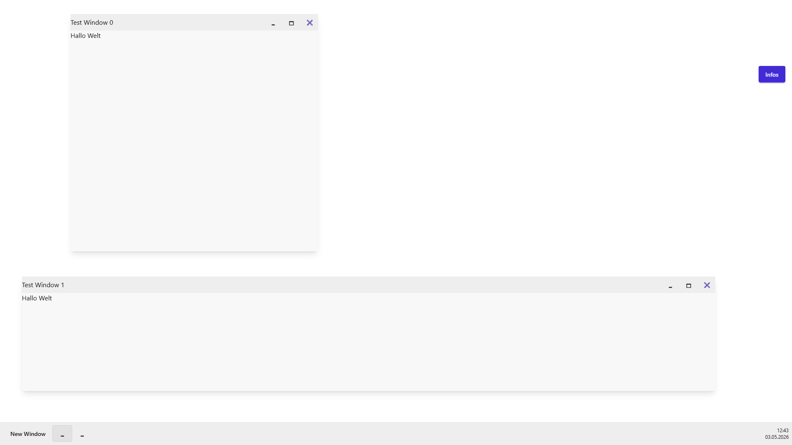
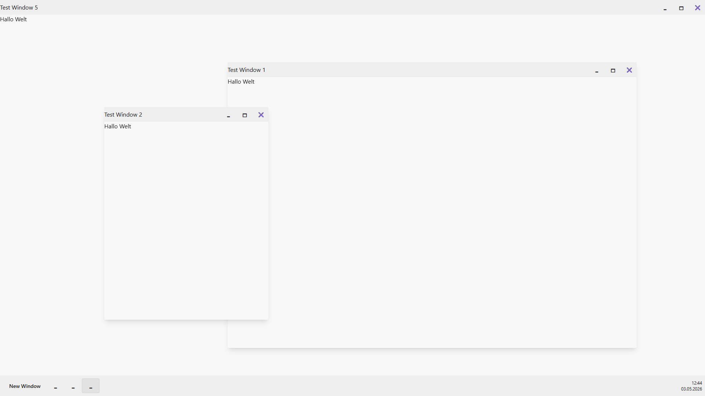
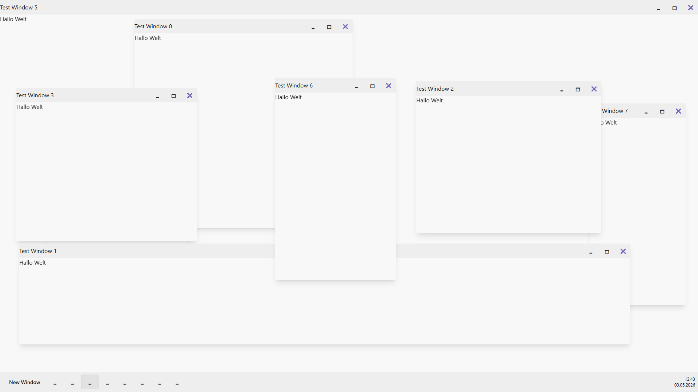

# 🖥️ Browser-Desktop

A modern, web-based desktop operating system built with **SvelteKit** and **TailwindCSS**.  
Browser-Desktop simulates an independent desktop environment inside your browser — featuring a window manager, taskbar, and customizable apps.


## 📸 Preview

🌐 **Live-Demo:** [browser-desktop.vercel.app](https://browser-desktop.vercel.app)

## 📸 Screenshots

### Desktop Overview



### Window Management



### Multi-Window Management



## 🚀 Features

- 📦 **Window system** with minimize, maximize, move and resize functionality
- 🖼️ **Dynamic window components** (external apps and modules can be integrated)
- 🕑 **Taskbar with live clock**
- 🔐 **Login system** (planned)
- 🎨 **Fully themeable via TailwindCSS**
- 💾 **Local storage for window states and session persistence** (planned)

## 📦 Technologies

- [SvelteKit](https://kit.svelte.dev/)
- [TailwindCSS](https://tailwindcss.com/)
- [TypeScript](https://www.typescriptlang.org/)
- [Runes](https://github.com/sveltejs/runes)
- [daisyUI 5](https://github.com/saadeghi/daisyui)

## 🛠️ Installation

```bash
git clone https://github.com/RalfKit/browser-desktop.git
cd browser-desktop
pnpm install
pnpm run dev
```

Then open `http://localhost:5173` in your browser.

## 🤝 Contributing

Ideas, feature requests, and pull requests are welcome!  
Feel free to [open an issue](https://github.com/RalfKit/browser-desktop/issues) to share feedback or suggestions.

---

**Browser-Desktop** — the virtual operating system for your browser.
